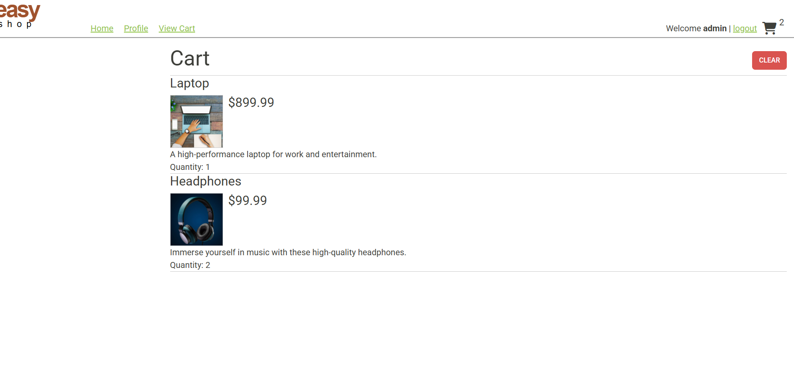
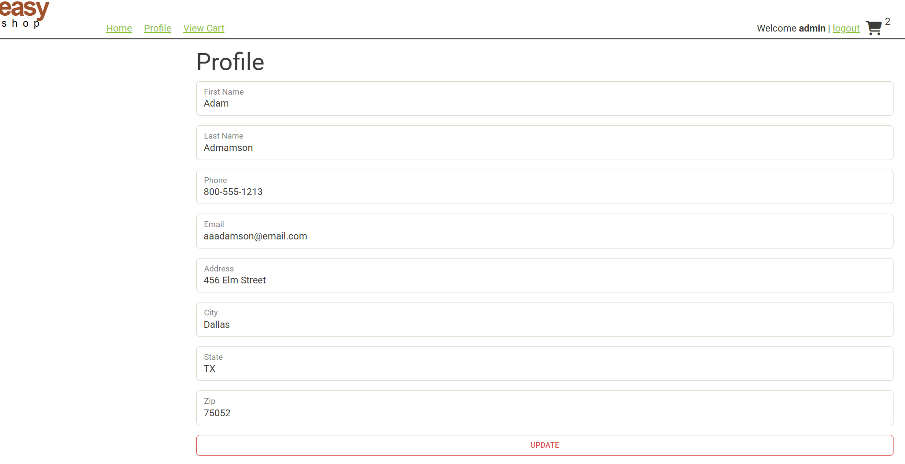
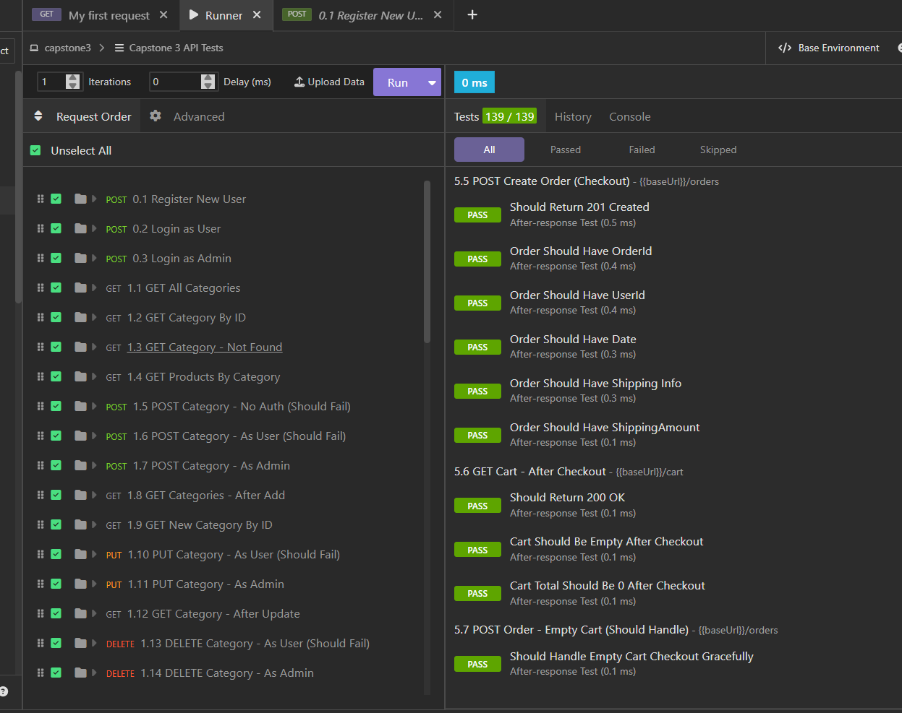

# EasyShop E-Commerce API

## Overview

EasyShop is a full-stack e-commerce application built using Java, Spring Boot, Spring Security, MySQL, and JavaScript. The application allows customers to browse products, manage shopping carts, update profile information, and place orders. Administrators can manage categories and products through secured endpoints.

This project demonstrates REST API development, authentication and authorization using JWT, database design with MySQL, and layered application architecture.

---

## Features

### Customer Features

* User Registration
* User Login with JWT Authentication
* Browse Categories
* Browse Products
* Search Products
* Shopping Cart Management
* User Profile Management
* Checkout and Order Creation

### Administrator Features

* Create Categories
* Update Categories
* Delete Categories
* Create Products
* Update Products
* Delete Products

### Security Features

* Spring Security
* JWT Authentication
* Role-Based Authorization
* Protected Endpoints

---

## Technologies Used

### Backend

* Java
* Spring Boot
* Spring Security
* Spring Data JPA
* MySQL
* JWT Authentication

### Frontend

* HTML
* CSS
* JavaScript
* Axios

### Development Tools

* IntelliJ IDEA
* MySQL Workbench
* Insomnia
* Git
* GitHub

---

## Database Tables

The application uses the following database tables:

* users
* profiles
* categories
* products
* shopping_cart
* orders
* order_line_items

---

## API Endpoints

### Authentication

| Method | Endpoint  |
| ------ | --------- |
| POST   | /register |
| POST   | /login    |

### Categories

| Method | Endpoint                  |
| ------ | ------------------------- |
| GET    | /categories               |
| GET    | /categories/{id}          |
| GET    | /categories/{id}/products |
| POST   | /categories               |
| PUT    | /categories/{id}          |
| DELETE | /categories/{id}          |

### Products

| Method | Endpoint       |
| ------ | -------------- |
| GET    | /products      |
| GET    | /products/{id} |
| POST   | /products      |
| PUT    | /products/{id} |
| DELETE | /products/{id} |

### Shopping Cart

| Method | Endpoint                   |
| ------ | -------------------------- |
| GET    | /cart                      |
| POST   | /cart/products/{productId} |
| PUT    | /cart/products/{productId} |
| DELETE | /cart                      |

### Profile

| Method | Endpoint |
| ------ | -------- |
| GET    | /profile |
| PUT    | /profile |

### Orders

| Method | Endpoint |
| ------ | -------- |
| POST   | /orders  |

---


## Interesting Code

One feature I enjoyed implementing was the checkout functionality. It retrieves the current user's shopping cart, creates an order, saves the order items, and clears the cart after a successful checkout.

```java
public Order checkout(int userId)
{
    ShoppingCart cart = shoppingCartService.getByUserId(userId);

    if(cart.getItems().isEmpty())
    {
        throw new ResponseStatusException(HttpStatus.BAD_REQUEST, "Shopping cart is empty");
    }

    Order order = orderRepository.save(order);

    for(ShoppingCartItem item : cart.getItems().values())
    {
        OrderLineItem lineItem = new OrderLineItem();
        lineItem.setOrderId(order.getOrderId());
        lineItem.setProductId(item.getProductId());
        lineItem.setQuantity(item.getQuantity());

        orderLineItemRepository.save(lineItem);
    }

    shoppingCartService.clearCart(userId);

    return order;
}
```

---

## Bug Fixes

### Bug #1 – Product Search

Fixed an issue where products were incorrectly filtered and some products were missing from search results.

### Bug #2 – Product Updates

Fixed an issue where product stock quantities were not being saved during updates.


---

## Screenshots

### Home Page


### Shopping Cart



### User Profile



### Insomnia API Testing



---

## How to Run

### Backend

1. Clone the repository.
2. Create the MySQL database.
3. Execute the provided database script.
4. Update database credentials in `application.properties`.
5. Run the Spring Boot application.

### Frontend

1. Navigate to the frontend folder.
2. Start a local web server:

```bash
python -m http.server 5500
```

3. Open:

```
http://localhost:5500
```

4. Ensure the backend is running at:

```
http://localhost:8080
```

---

## Author

**Abeer Garges**
